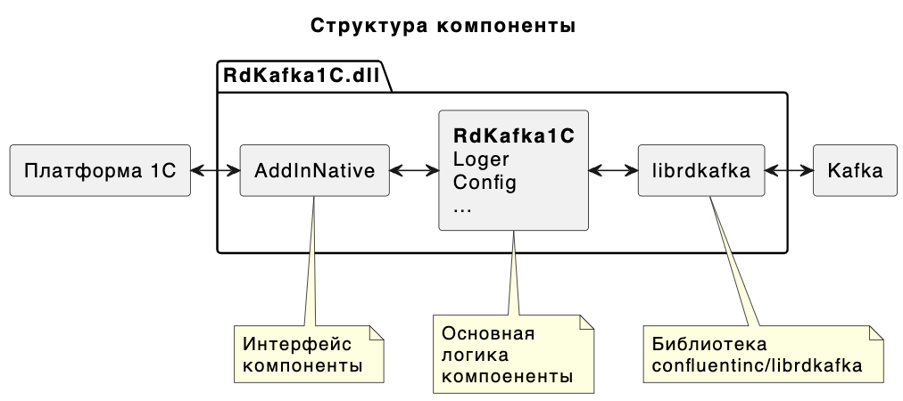

# Внешняя компонента Rdkafka-1C

Версия 1.1.1

[Сборка внешней компоненты](./doc/build.md)
- [Менеджер пакетов vcpkg](./doc/vcpkg.md)
- [Настройка cmake](./doc/cmake.md)
- [Тестовый Apache Kafka и веб интерфейс](./doc/kafka.md)

[Использование](./doc/how-to-use.md)

Rdkafka-1c - это внешняя компонента разработанная на языке C++ для обмена приложений на языке 1С с брокером сообщений Kafka. Компонента использует производительную многопоточную библиотеку [librdkafka](https://github.com/confluentinc/librdkafka) и разработана в соответствии с рекомендациями фирмы 1С по разработке [внешних компонент](https://its.1c.ru/db/metod8dev/content/3221/hdoc).

## Ссылки

- [Технология создания внешних компонент](https://its.1c.ru/db/metod8dev/content/3221/hdoc)
- [librdkafka](https://github.com/confluentinc/librdkafka)
- [googletest](https://github.com/google/googletest)
- [vcpkg](https://github.com/microsoft/vcpkg)
- [cmake](https://cmake.org)