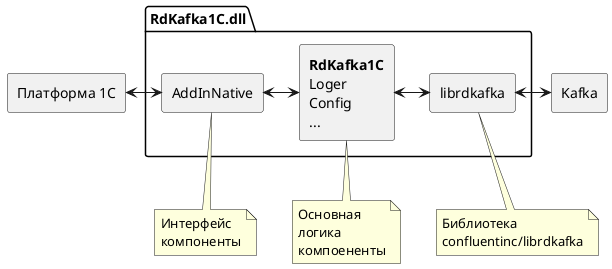

# Внешняя компонента для обмена 1С с Kafka

Версия 0.3.1-beta

**!!! Проект в разработке !!!**

[Сборка внешней компоненты](./doc/build.md)

Структура помпоненты

## Использование

## Пример обработки 1С

В каталоге /epf размещен пример обработки для демонстрации возможностей внешней компоненты.

## Ссылки

- [librdkafka](https://github.com/confluentinc/librdkafka)
- [googletest](https://github.com/google/googletest)
- [vcpkg](https://github.com/microsoft/vcpkg)