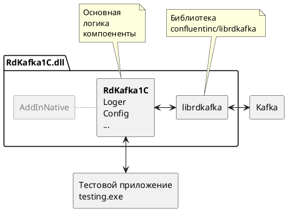

# Сборка внешней комопненты RdKafka1C

## Требуемое программное обеспечение

- [Платформа 1С Предприятие](https://1c.ru)
- [MS Visual Studio C++](https://visualstudio.microsoft.com/) - для Windows
- Компилятор g++ - для Linux
- [MS VSCode](https://code.visualstudio.com/)
- [CMake](https://github.com/Kitware/CMake/releases)
- [vcpkg](https://github.com/microsoft/vcpkg)
- [Docker](https://www.docker.com)

## Сборка

Чтобы собрать проект необходимо:

1. Установить требуемое программное обеспечение
2. Собрать [тестовый инстанс Apache Kafka](./doc/kafka.md)
3. Выполнить первоначальную [настройку cmake](./doc/cmake.md)
4. Выполнить первоначальную [настройку vcpkg](./doc/vcpkg.md)
5. Запустить скрипт сборки `/build.bat` или `/build.sh` для Linux

[*] Компилятор g++ в Linux можно установить командой:
```sh
sudo apt install g++
```

Результатом сборки будет динамическая библиотека для Windows `/build/Release/RdKafka1C.dll` или для Linux `/build/Release/libRdKafka1C.so` скомпилированная в режиме Relese, которую можно подключить к 1С, но нельзя отлаживать. Для отладки тредуется собрать библиотеку с параметром `--config "Release"` через IDE или скрипт cmake.

## Разработка

Для разработки на Windows и Linux использовался [MS VSCode](https://code.visualstudio.com/) для отладки на Windows из 1С [MS Visual Studio C++](https://visualstudio.microsoft.com/).

## Тесты

Компонента покрыта интеграционными тестами на основе библиотеки [GTest](https://github.com/google/googletest). Тесты проверяют корректность выполнения обмена и обработку ошибкок с тестовым инстансом Kafka.



## Известные проблемы

### Ошибка "No such file or directory"

При сборке на Ubuntu Server может появиться ошибка `uuid/uuid.h: No such file or directory`. Необходимо установить пакет uuid.

```sh
sudo apt install uuid-dev
```
