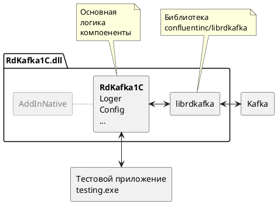

# Сборка внешней комопненты RdKafka1C

## Требуемое программное обеспечение

- [Платформа 1С Предприятие](https://1c.ru)
- [MS Visual Studio C++](https://visualstudio.microsoft.com/)
- [MS VSCode](https://code.visualstudio.com/)
- [CMake](https://cmake.org/download/)
- [vcpkg](https://github.com/microsoft/vcpkg)
- [Docker](https://www.docker.com)

> Внимание! Перед использованием на Linux проверьте наличие русской локали `locale -a`
> 
> Если нет локали, её можно добавить:
> ```
> sudo locale-gen ru_RU
> sudo locale-gen ru_RU.UTF-8
> sudo update-locale 
> ```

## Сборка

Чтобы собрать проект необходимо:

1. Установить требуемое программное обеспечение
2. Собрать [тестовый инстанс Apache Kafka](./doc/kafka.md)
3. Выполнить первоначальную [настройку vcpkg](./doc/vcpkg.md)
3. Запустить скрипт сборки `/build.bat`

Результатом сборки будет динамическая библиотека для Windows `/build/Release/RdKafka1C.dll` или для Linux `/build/Release/libRdKafka1C.so`  скомпилированная в режиме Relese, которую можно подключить к 1С, но нельзя отлаживать.

## Разработка

Для разработки в основном использовалась [MS Visual Studio C++](https://visualstudio.microsoft.com/) для отладки компоненты при запуске из 1С [MS Visual Studio C++](https://visualstudio.microsoft.com/)

## Тесты

Компонента покрыта интеграционными тестами на основе библиотеки [GTest](https://github.com/google/googletest). Тесты проверяют корректность выполнения обмена и обработку ошибкок с тестовым инстансом Kafka.

